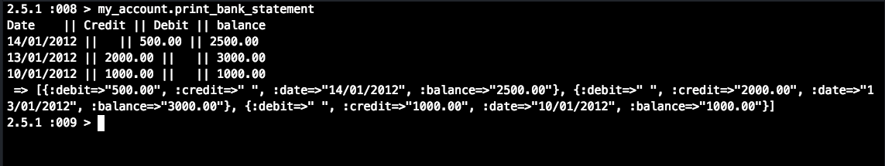
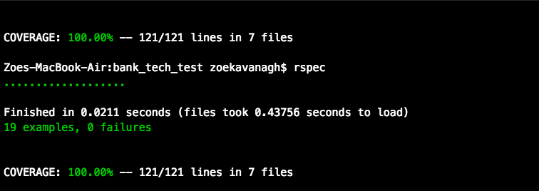

### Bank Account Tech Test

#### What is the problem that needs solving?

You should be able to interact with your code via a REPL like IRB. (You don't need to implement a command line interface that takes input from STDIN.)

Deposits, withdrawal.

Account statement (date, amount, balance) printing.
Data can be kept in memory (it doesn't need to be stored to a database or anything).

```
date || credit || debit || balance
14/01/2012 || || 500.00 || 2500.00
13/01/2012 || 2000.00 || || 3000.00
10/01/2012 || 1000.00 || || 1000.00
```
#### How did I approach designing my solution?

I took a TDD approach to meeting the above requirements - this means that I started by writing tests before building my code.

I also took an Object Orientated approach to the design of my app.  I identified the three core functionalities that were required: Logging transactions, withdraw/deposit capabilities, printing the statement to the console.

Whilst taking a TDD approach, I also created a test version of the app, which allowed me to test various ways of creating a solution before implementing the code.

#### How I structured my code and why

Based on the SOLID principles, it was clear that my app would be consist of at least three classes each with their single responsibility.  The BankAccount class was the mothership, calling on the PrintStatement class and TransactionHistory class.

By structuring my code this way, if in future any changes need to be made to how transactions were logged or how the statement would print, these could amended easily without breaking the rest of my code.  I also tried to keep my methods as short as possible.

#### How to install my code and tests

Firstly, clone my repo. Then run the following commands in your command line:
~~~
bundle install
irb
require './spec/bank_account'
> my_account = BankAccount.new
> my_account.deposit(500)
> my_account.withdraw(200)
> my_account.print_bank_statement
~~~
You should get something like this . .


#### Testing

I maganged to acheive 100% text coverage.


